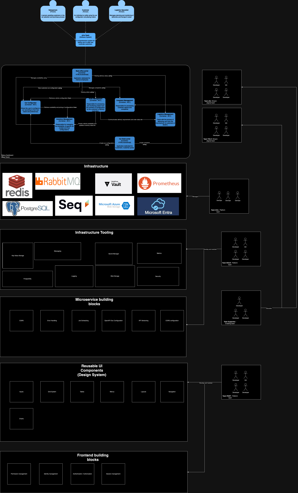

# Code sharing strategy
Based on the experiences I have gained while working with various companies, I would like to share my thoughts on organizing work with shared code / shared capabilities.

## What you will learn from this repository:
- How to approach code sharing in an organization
- Who should be responsible for maintaining this code and implementing it in teams
- What to pay attention to when creating reusable code in an organization (what rules should be followed)
- How to manage shared code - One big library or many small ones?
- What code should never be shared?
- Why is the role of the Enabling team very important in the organization? (and very often overlooked!)
- What are the disadvantages of this approach?

## Introduction 
A car selling company decided to create a new platform for selling cars. The company has its own IT department which has already created several systems for the company's needs. As the IT department does not have enough programmers to create a new system, it decides to create two teams of newly hired developers.

  

